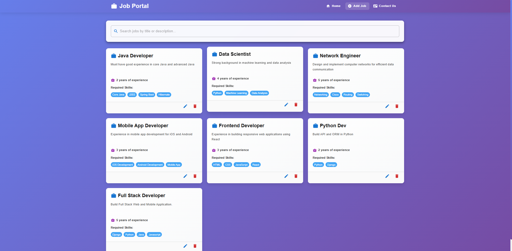
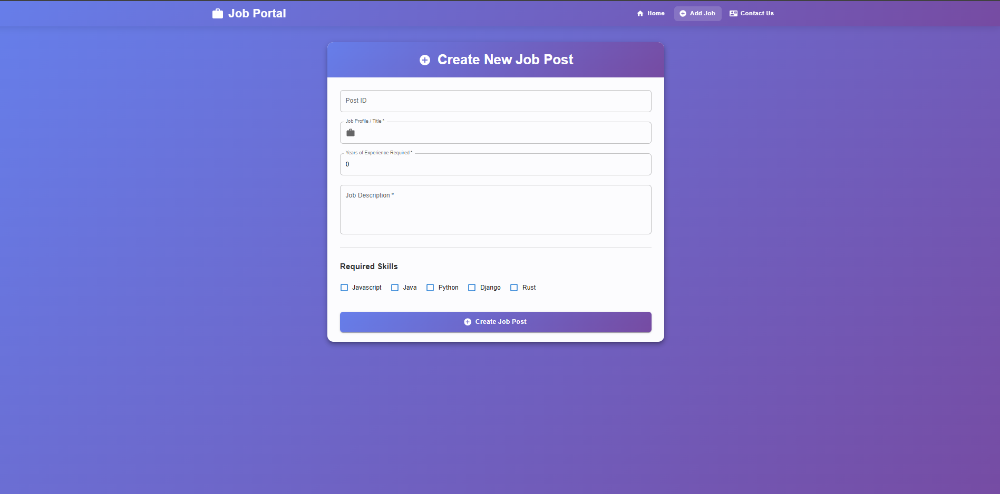

# Job Portal

A simple job portal app I built using Spring Boot for the backend and React for the frontend. You can browse jobs, search for them, and manage job postings with full CRUD operations.

## Screenshots


*The main page with all job listings*


*Form to create a new job posting*

## What it does

- View all job postings in a nice card layout
- Search jobs by title or description (with debouncing to avoid too many API calls)
- Create, edit, and delete job postings
- Modern UI with Material-UI components and a gradient theme
- Responsive design that works on mobile too

## Tech Stack

**Backend:**
- Java 21
- Spring Boot 3.5.4
- Spring Data JPA
- PostgreSQL
- Maven

**Frontend:**
- React 18
- Material-UI
- React Router
- Axios for API calls

## Getting Started

### Prerequisites

You'll need:
- JDK 21 or higher
- Maven 3.6+
- Node.js 14+ and npm
- PostgreSQL 12+
- Git

### Setup

1. **Clone the repo:**
   ```bash
   git clone https://github.com/wigglevig/job-portal.git
   cd job-portal
   ```

2. **Set up the database:**
   - Create a PostgreSQL database:
     ```sql
     CREATE DATABASE jobportal;
     ```
   - Copy the example config file:
     ```bash
     cp Backend/src/main/resources/application.properties.example Backend/src/main/resources/application.properties
     ```
   - Edit `Backend/src/main/resources/application.properties` and add your database credentials

   **Note:** The `application.properties` file is gitignored, so your credentials won't be committed. You can also use environment variables instead (see the Security section below).

3. **Run the backend:**
   ```bash
   cd Backend
   mvn spring-boot:run
   ```
   The API will be available at `http://localhost:8080`

   To load some sample data, visit `http://localhost:8080/load` in your browser.

4. **Run the frontend:**
   In a new terminal:
   ```bash
   cd Frontend
   npm install
   npm start
   ```
   The app will open at `http://localhost:3000`

## Project Structure

```
Job-Portal/
├── Backend/
│   └── src/main/java/com/wiggle/springbootrest/
│       ├── JobRestController.java    # API endpoints
│       ├── model/JobPost.java        # Job entity
│       ├── repo/JobRepo.java         # JPA repository
│       └── service/JobService.java   # Business logic
│
└── Frontend/
    └── src/components/
        ├── AllPosts.jsx    # Main page with job listings
        ├── Create.jsx      # Create job form
        ├── Edit.jsx        # Edit job form
        └── Navbar.jsx      # Navigation bar
```

## API Endpoints

Base URL: `http://localhost:8080`

| Method | Endpoint | Description |
|--------|----------|-------------|
| GET | `/jobPosts` | Get all jobs |
| GET | `/jobPost/{postId}` | Get job by ID |
| GET | `/jobPosts/keyword/{keyword}` | Search jobs |
| POST | `/jobPost` | Create new job |
| PUT | `/jobPost` | Update job |
| DELETE | `/jobPost/{postId}` | Delete job |
| GET | `/load` | Load sample data |

Example request to create a job:
```bash
POST http://localhost:8080/jobPost
Content-Type: application/json

{
  "postId": 6,
  "postProfile": "Full Stack Developer",
  "postDesc": "Experience in React and Spring Boot",
  "reqExperience": 3,
  "postTechStack": ["React", "Spring Boot", "PostgreSQL"]
}
```

## Data Model

Each job post has:
- `postId`: Unique ID
- `postProfile`: Job title
- `postDesc`: Job description
- `reqExperience`: Years of experience required
- `postTechStack`: List of required skills/technologies

## Features

The search is debounced (waits 500ms after you stop typing) to avoid making too many API calls. The UI shows loading indicators while fetching data.

The frontend uses Material-UI components with a purple gradient theme. Job cards have hover effects, and skills are displayed as chips. The search bar shows a spinner while loading results.

## Building for Production

**Backend:**
```bash
cd Backend
mvn clean package
```
The JAR file will be in `Backend/target/`

**Frontend:**
```bash
cd Frontend
npm run build
```
The build will be in `Frontend/build/`

## Security

The `application.properties` file with your database credentials is gitignored. You can also use environment variables:

**Linux/Mac:**
```bash
export DATABASE_URL=jdbc:postgresql://localhost:5432/jobportal
export DATABASE_USERNAME=your_username
export DATABASE_PASSWORD=your_password
```

**Windows (PowerShell):**
```powershell
$env:DATABASE_URL="jdbc:postgresql://localhost:5432/jobportal"
$env:DATABASE_USERNAME="your_username"
$env:DATABASE_PASSWORD="your_password"
```

The app will use environment variables if they're set, otherwise it falls back to `application.properties`.

If you've already committed credentials to git, remove the file from tracking:
```bash
git rm --cached Backend/src/main/resources/application.properties
git commit -m "Remove credentials from version control"
```
And change your database password if the repo is public!

## Testing

```bash
# Backend tests
cd Backend
mvn test

# Frontend tests
cd Frontend
npm test
```

## Contributing

Feel free to open issues or submit pull requests. If you want to contribute:

1. Fork the repo
2. Create a feature branch
3. Make your changes
4. Submit a pull request

## License

MIT License - feel free to use this project however you want.

## Author

Vignesh Pandi - [GitHub](https://github.com/wigglevig)

## Acknowledgments

Thanks to the Spring Boot and React communities, and Material-UI for the great components. Also thanks to Telusko for the learning resources.

---

**Note:** Make sure both the backend and frontend are running at the same time for the app to work properly.
